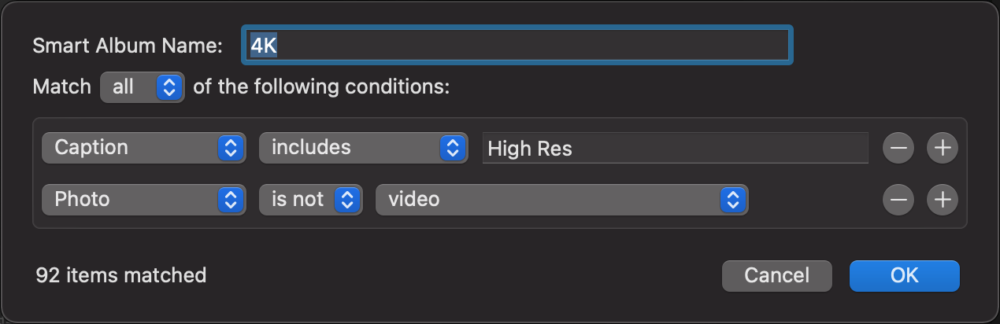

# macOS Photos Filter 4K

## Getting Started

```applescript
with timeout of 30000 seconds
	tell application "Photos" to ¬
		set the description of ¬
			(every media item whose ¬
				(height > width and height = 3840) or ¬
				(width > height and width = 3840)) to ¬
			"4K High Res"
end timeout

display alert "Done."
```

1. Create a file named `4K.scpt` or download the [file](./4K.scpt)
1. Then, run the script by opening Script Editor. This might take a significant time, so leave your Mac run this overnight.
1. On your `photos.app`, create a smart folder with rules something like this: 
1. Voila!
